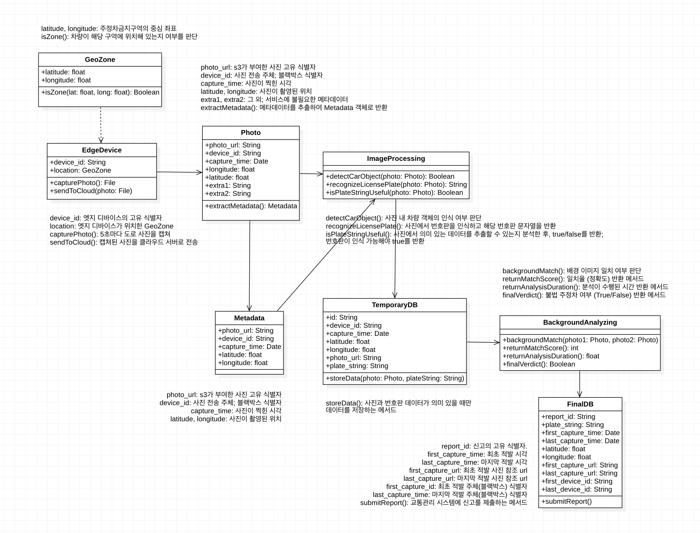

# Team-Info
| (1) 과제명 | Gotcha: 도로안전 개선을 위한 블랙박스 데이터 속 불법주정차 AI 탐지 및 신고 클라우드 서비스
|:---  |---  |
| (2) 팀 번호 / 팀 이름 | 13-AI:D |
| (3) 팀 구성원 | 박소현 (2176143): 리더, 클라우드 아키텍처 설계 김연우 (2183005): 팀원, 클라우드 서버 개발 이희수 (2129030): 팀원, AI 알고리즘 구현 |
| (4) 팀 지도교수 | 심재형 교수님 |
| (5) 팀 멘토 | 오종훈 / 부장,팀장 / 클라우드네트웍스 |
| (6) 과제 분류 | 산학과제 |
| (6) 과제 키워드 | 클라우드, AI, Object Detection |
| (7) 과제 내용 요약 | 불법주정차 신고절차를 자동화하는 서비스로, 블랙박스 데이터를 활용하여 불법주정차를 AI로 탐지, 이후 클라우드 내 메타데이터 간 비교분석을 수행하여 준법 여부를 가려내어 해당 차량이 자동으로 신고되게 하고자 한다. |

 

# Project-Summary
| 항목 | 내용 |
|:---  |---  |
| (1) 문제 정의 | 1. 문제  &ensp; - 안전문제  &ensp; 불법주정차는 도시 내에서 통행 안전과 효율적인 교통 흐름을 저해하는 주요 원인이다. 특히 불법주정차로 인한 어린이 보호구역에서의 교통사고는 심각한 사회적 이슈로 대두되고 있다. 도로교통공단의 보고에 따르면, 서울시 어린이 보호구역에서 발생하는 사고의 28%는 도로변에 불법 주정차된 차량으로 인해 운전자가 아이들을 발견하지 못해 발생한 것으로 나타났다. 더불어 2019년에는 불법 주정차와 관련된 자동차 사고가 총 85,854건 발생하는 등 불법주정차 문제는 도로안전을 위협하고 있다.  &ensp; - 안전신문고  &ensp; 주민신고제가 운영되고 있는 안전신문고는 앱 실행 후 촬영한 사진의 일시가 표시된 경우만 신고할 수 있도록 하는 등, 신고 조건이 까다롭고 앱 실행 속도가 느려 사용자들의 불만을 초래하고 있다. 이러한 문제는 앱의 평점이 1점대에 불과하다는 사실로도 확인할 수 있다.    2. 타겟 고객 및 페인 포인트  &ensp; - 운전자  &ensp; 운전자는 도로 위 불법 주정차로 인해 혼잡해진 도로 환경에서 안전한 운전 경험을 보장받지 못하고 있으며, 이를 해결하기 위해 안전신문고 앱으로 신고하는 과정이 다소 번거롭다. 안전신문고의 신고 절차는 불법 주정차 유형 선택, 상세 기준 및 주의사항 확인, 사진 촬영, 위치 입력, 내용 입력 등 여러 단계를 포함하고 있어 상당히 복잡하여 신고를 주저하게 되는 상황이다.  &ensp; - 정부  &ensp; 현재 정부는 불법주정차 단속을 위해 투입되는 인력과 자원은 상당하지만, 이를 통해 얻어지는 세수는 상대적으로 미미한 상황이다. 이는 행정 비용은 과도하게 투입되는 반면, 단속을 통해 실질적으로 얻은 재정적 수익이 크지 않다는 문제를 나타낸다. 또한, 불법주정차로 인한 도로 혼잡으로 원활하지 않은 교통 환경이 조성되어 결과적으로 경제적 손실까지 초래할 수 있다. |
| (2) 기존연구와의 비교 | - 안전신문고  &nbsp; 안전신문고는 시민들이 안전과 관련된 위법 행위를 신고할 수 있도록 지원하는 서비스로, 불법 주정차를 포함한 다양한 안전 문제를 신고할 수 있는 플랫폼이다.  &nbsp; 운전자를 비롯한 국민들이 자신이 느끼는 문제에 대해 안전신문고를 통한 신고로 직접적인 개입이 가능하다는 면에서 장점을 가지지만,  불법주정차 신고의 경우, 불법 주정차 유형 선택, 상세 기준 및 주의사항 확인, 사진 촬영, 위치 입력, 내용 입력 등 여러 단계로 이루어져 신고 절차가 매우 번거롭다는 단점을 가지고 있다.  &nbsp; 이와 달리 Gotcha는 운전자에게 요구되는 신고 절차가 존재하지 않는다. Gotcha는 ai와 클라우드에 기반하여 운전자에게 요구됐던 불법주정차 발견 및 신고 절차를 자동화한 서비스를 제공한다.    - 불법 주정차 계도 및 단속 시스템  &nbsp; 불법 주정차 계도 및 단속 시스템은 서대문구에 구축된 시스템으로, IOT를 활용하여 어린이보호구역 내 안심승하차 존에 차량이 진입하고 허용 시간을 초과하였을 때 점멸 신호, 음성 안내 등으로 계도 및 단속한다.  &nbsp; 불법주정차에 대한 신속, 상시 대응체계를 구축하여 어린이 승하차 존의 이용 편의성을 보장할 수 있다는 장점을 가지지만, 해당 시스템은 어린이보호구역 내에서도 안심승하차 존의 불법주정차만 다룬다는 단점을 가지고 있다.  &nbsp; 이와 달리 Gotcha는 어린이보호구역을 포함하여 구에서 제공하는 불법주정차 금지구역 데이터를 토대로 구의 모든 불법주정차 금지구역을 다룬다. 따라서 Gotcha는 해당 시스템보다 더 많은 수의 불법주정차 단속이 가능하다.|
| (3) 제안 내용 | 블랙박스 데이터 속 불법 주정차 차량을 AI로 탐지하고, 이를 자동으로 신고해주는 클라우드 서비스인 갓차(Gotcha)를 제안한다. 해당 서비스는 AI와 클라우드 기술을 결합하여 기존의 수동적인 불법 주정차 단속 방식을 혁신하여 교통 안전과 효율성을 동시에 향상시키는 것을 목표로 한다. |
| (4) 기대효과 및 의의 | 1. 교통 안전 문제 개선  &nbsp; 교통 안전 개선과 관련해 주목할 만한 해외 사례로는 미국 뉴저지주 호보켄시를 들 수 있다. 이 도시는 2017년 '비전 제로(Vision Zero)' 정책을 도입한 이후 7년간 교통사고 사망자가 한 명도 발생하지 않았다. 이러한 성공 사례는 불법 주정차 감소가 교통 사고 예방에 큰 영향을 미친다는 점을 보여준다. 2023년 기준 약 2,500만 대 이상의 차량이 등록된 대한민국에서도 갓차 서비스 도입을 통해 불법 주정차 신고가 증가하면, 불법 주정차가 크게 줄어들고 그로 인해 교통사고 발생률이 감소할 것으로 예상된다. 교통 안전 강화는 갓차 서비스의 핵심 목표 중 하나이다.    2. 세수 증대 효과  &nbsp; 불법 주정차로 인한 과태료 부과는 건당 약 6만 2천 원의 편익을 제공하며, 2023년 불법 주정차 신고 수를 고려했을 때, 이론적으로 약 3,035억 원의 추가 세수를 확보할 수 있다. 이는 불법 주정차 단속을 자동화함으로써 보다 효율적으로 세금을 징수할 수 있다는 것을 의미하며, 이러한 세수는 공공 서비스 개선 및 교통 인프라 확충과 같은 다양한 공공사업에 활용될 수 있다. 따라서 갓차 서비스는 단순한 신고 자동화를 넘어, 사회적 가치 창출에 기여할 수 있을 것으로 기대된다.    3. 단속 비용 절감 및 효율성 향상  &nbsp; 현재 불법 주정차 단속에는 인력이 제한적으로 투입되고 있으며, 이로 인해 단속 범위와 효과에 한계가 있다. 갓차 서비스는 이러한 문제를 해결하기 위해 AI 기반의 자동화된 단속 시스템을 제공한다. 이를 통해 단속 비용을 절감하고, 더 나아가 단속 인력 확충 없이도 더 넓은 범위에서 효과적인 단속이 가능해진다. 자동화 서비스의 도입은 정부의 비용 절감은 물론, 단속 효율성을 크게 높여줄 것으로 예상된다.|
| (5) 주요 기능 리스트 | - 객체 탐지: 갓차의 핵심 기능 중 하나는 블랙박스 영상에서 불법 주정차 차량을 실시간으로 탐지하는 것이다. YOLO(You Only Look Once)와 같은 최신 딥러닝 기반 객체 탐지 모델을 사용하여, 차량을 빠르고 정확하게 식별한다.   - 번호판 인식: 탐지된 차량에서 번호판을 인식하는 과정이 필요하다. 이를 위해 PaddleOCR 등의 딥러닝 기반 문자 인식 모델을 사용하여, 차량 번호판 정보를 정확하게 추출한다. 이 정보는 신고 시 중요한 식별 요소가 되며, 정확한 번호판 인식을 통해 오인 신고를 방지하고 신고의 신뢰도를 높인다.   - 배경 분석: 불법 주정차가 의심되는 차량의 신고가 들어왔을 때, 이를 단순히 처리하는 것이 아니라 추가적인 배경 분석을 통해 신고의 정확성을 높이는 과정이 필요하다. 예를 들어, 동일한 차량이 5분 이상의 간격을 두고 두 번 이상 탐지된 경우, 신고를 확정하는 프로세스를 통해 중복 신고나 잘못된 신고를 걸러낸다.|

 
 
# Project-Design
| 항목 | 내용 |
|:---  |---  |
| (1) 요구사항 정의 | **기능별 상세 요구사항(또는 유스케이스)**   **1. 유스케이스 이름**  &ensp; 불법주정차 감지 및 자동신고 (신고될 게 자명한 정보 전달)    **2. 목적**  &ensp; 불법주정차 구역에서 차량의 번호판을 인식하고, 반복적으로 적발된 차량을 신고하는 과정을 자동화한다.    **3. 주요 액터**  &ensp; - 운전자: 엣지 디바이스가 탑재된 차량의 사용자. 단속 시간 내 불법주정차구역에 진입하면 시스템에 의해 자동으로 감지된다.  &ensp; - 클라우드 서버: 사진 업로드, 메타데이터 처리, 이미지 분석, 신고 등 주요 프로세스를 처리하는 서버.  &ensp; - 교통관리 시스템: 민원 접수 후 불법주정차 차량 정보를 처리하는 외부 시스템.    **4. 사전 조건**  &ensp - 블랙박스(엣지 디바이스)가 정상적으로 작동하며, 지정된 주정차금지구역에 단속시간 내 진입한다.  &ensp; - 클라우드 서버는 정상적으로 운영되고 있으며, 이미지 분석과 데이터 처리가 가능하다.    **5. 후행조건**  &ensp; - 불법주정차 차량이 감지되면 해당 차량에 대한 신고정보가 지자체 및 담당 부서로 전송된다.  &ensp; - 신고 관련 최종 데이터는 최종 DB에 저장된다.    **6. 기본 흐름**  &ensp; 1) 운전자가 주정차금지구역에 진입  &emsp; - 운전자가 엣지 디바이스가 장착된 차량을 주정차금지구역으로 운전하고 들어온다.  &emsp; - 엣지 디바이스(블랙박스)는 이 구역 진입을 감지하고, 도로 사진을 5초마다 자동으로 촬영하여 클라우드 서버로 전송한다.  &ensp; 2) 클라우드 서버로 사진 전송  &emsp; - 엣지 디바이스는 촬영된 도로 사진을 클라우드 서버의 스토리지에 업로드한다.  &emsp; - 업로드되는 사진에는 시각과 위치 정보가 메타데이터로 포함되어 있다.  &ensp; 3) 메타데이터 추출  &emsp; - 클라우드 서버는 업로드된 사진의 메타데이터(위도, 경도, 시간)를 추출한다.  &emsp; - 추출된 메타데이터는 임시 DB에 우선적으로 저장된다.  &ensp; 4) 이미지 분석 및 번호판 인식  &emsp; - 서버는 AI 기반 이미지 분석을 통해 차량의 번호판을 인식한다.  &emsp; - 인식된 번호판 문자열은 메타데이터와 함께 임시 DB에 저장된다.  &ensp; 5) 동일 차량 비교 분석  &emsp; - 클라우드 서버는 하루 동안 저장된 사진 데이터에서 동일한 번호판을 가진 차량을 비교 분석한다.  &emsp; - 동일 차량이 5분 이상의 간격으로 여러 번 적발된 경우, 해당 차량이 불법주정차를 했다고 판단한다.  &ensp; 6) 배경 이미지 분석  &emsp; - 서버는 최초 적발 사진과 마지막 적발 사진의 배경 이미지를 분석하여, 차량이 동일 위치에 계속 주정차하고 있었는지 확인한다.  &emsp; - 배경 분석 결과 정확도가 임계치를 넘을 경우 불법주정차로 판정된다.  &ensp; 7) 민원 접수 및 데이터 저장   - 불법주정차가 확인된 차량의 정보(번호판, 위치, 시간 등)를 교통관리 시스템에 자동으로 민원 접수한다.  &emsp; - 동시에, 다음 정보가 최종 DB에 저장된다: 신고 ID, 차량 번호판, 최초 적발 사진 송신자 ID, 마지막 적발 사진 송신자 ID, 적발 위치 (위도, 경도), 최초 및 마지막 적발 시간, 최초 및 마지막 적발 사진 URL    **7. 대체 흐름**  &ensp; - 엣지 디바이스 오류 발생: 블랙박스가 제대로 작동하지 않을 경우, 사진 업로드가 실패할 수 있다. 이때 클라우드 서버는 데이터를 재요청하며, 일정 시간이 지나도 응답이 없으면 시스템 로그에 오류를 기록하고 종료한다.  &ensp; - 번호판 추출 실패: 사진 내에서 차량 객체 자체를 식별할 수 없거나, 사진 내에서 문자열이 인식되지 않거나 데이터의 일관성을 해치는 포맷이 추출된 경우, 임시DB 내에 해당 레코드를 삭제하거나, 유효하지 않음(NULL)을 표시한다.  &ensp; - 배경 이미지 분석 실패: 배경 분석 결과 정확도가 임계치를 넘지 못할 경우, 신뢰할 수 없는 분석 결과로 판단하여 불법주정차 여부를 False로 반환하고 최종DB에 해당 레코드를 기록하지 않는다.    **8. 비기능적 요구사항**  &ensp; - 클라우드 서버는 3초 이내에 차량 번호판을 인식하고 결과를 처리해야 한다.  &ensp; - 번호판 추출 시 정확도는 95% 이상이어야 하며, 배경 이미지 분석의 임계치는 80%에 준해야 한다.  &ensp; - 하루 최대 100만 건의 사진을 처리할 수 있어야 한다.     **설계 모델(클래스 다이어그램, 클래스 및 모듈 명세서)**    |
| (2) 전체 시스템 구성 |    1. **블랙박스 영상 수집 및 클라우드 전송(User to S3)**: 차량에 장착된 블랙박스는 실시간 녹화를 진행하고, 1초 단위로 캡쳐된 사진을 클라우드에 전송한다.   **2. 메타데이터 추출 및 주정차금지구역/시간 비교(S3 to Lambda)**: 업로드된 사진의 위치/시간 추출 후, 주정차금지구역 및 시간에 해당하는 데이터 필터링한다.   **3. 차량 추출 및 번호판 인식(Lambda to EC2, EC2 내부 코드)**: 필터링된 데이터를 인덱스로 하는 사진 분석 하여 사진 내 신뢰도가 가장 높은 자동차의 번호판 인식 및 문자열 추출 후 임시 신고 테이블 업데이트   **4. 하루에 한번 확정신고 테이블 업데이트(EC2 내부 Cron job 예약)**: 5분 간격 이상의 두개 이상의 같은 차량에 대한 신고가 있을 시 두 테이블 이미지 경로 기반으로 배경 분석 진행한다. 배경 분석 정확도가 0.8 이상일 경우 확정신고 테이블에 해당 신고를 추가한다.   **5. 하루에 한번 확정 신고 테이블 전송 API (EventBridge 규칙 설정 및 Lambda)**: 당일 내 처리된 확정 신고 테이블을 외부 신고처를 보내는 API를 호출한다.|
| (3) 진척도 및 검증내역 | 1. 스타트 검증 내용  &ensp; 1) 클라우드 환경에서 로직 구현  &emsp; - 이미지 메타데이터 추출  &emsp; - 신고 대상 필터링 후 로깅  &ensp; 2)  AI 기술 구현  &emsp; - 차량 탐지 및 번호판 인식 - 93%    2. 진척도 및 근거 내용  &ensp; **진척도: 70%**  &emsp; 1) 번호판 인식 알고리즘 - 100%  &emsp;&emsp; - 객체 탐지 알고리즘 YOLO를 이용하여 도로 이미지에서 신뢰도가 가장 높은 차량을 선택하고 문자 인식 알고리즘 OCR을 이용하여 번호판을 인식한다.  &emsp;&emsp; - 번호판 패턴을 갖는 반환 문자열 기준 정확도 100%를 달성했다.  &emsp; 2) 배경 분석 알고리즘 - 100%  &emsp;&emsp; - 비교 대상인 두 개의 이미지를 resize한 후, Resnet50 모델을 활용하여 코사인 유사도를 계산한다.  &emsp;&emsp; - 동일차량 기준, 동일 위치에 있을 때 배경일치 판단에 대한 정확도 평균이 91%, 그렇지 않을 경우 66%로 기록되었다. 도로 환경의 유사성을 고려하여 같은 배경의 사진임을 판단하는 기준 임계를 0.8로 설정하였다.  &emsp; 3) 클라우드 환경 구성 및 통합 - 50%  &emsp;&emsp; - 사진이 전송되는 S3와 이를 트리거로 실행되는 메타데이터 추출 함수 간의 통합은 성공적으로 완료되었다.  &emsp;&emsp; - EC2 서버 내에서 실행될 AI 모델 코드는 Colab 환경에서 구현을 마쳤으며, 해당 코드를 EC2 내에서 원활히 작동하도록 하는 배포 작업은 진행 중에 있다.  &emsp;&emsp; - RDS DB 구축은 완료된 상태이며, EC2와의 연동 작업은 향후 계획된 일정에 따라 진행할 예정이다.  &emsp; 4) 신고 전송 API 구현 - 0%  &emsp;&emsp; - 확정된 신고가 저장되는 DB를 기반으로 신고처에 전송하는 API는 클라우드 환경 내 통합이 완성된 이후 진행할 예정이다.|
| (4) 기타 |  |

 
