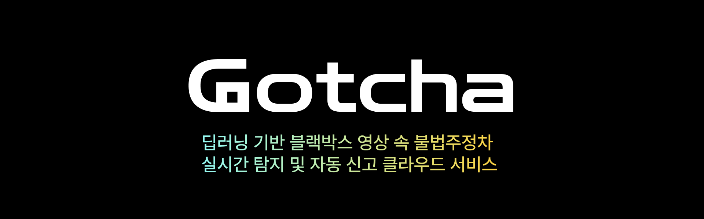

### Gotcha : 딥러닝 기반 블랙박스 영상 속 불법주정차 실시간 탐지 및 자동 신고 클라우드 서비스
---
### Skill
---

 
   
   
   
  
   
   
   
   
   

### Main Feature
---
1. 번호판 인식
2. 이미지에서 메타데이터 추출
3. 신고 대상 필터링 후 로깅
### Developers
---
||||
|:-:|:-:|:-:|
|sohyun park [@sohvun](https://github.com/sohvun)|Yeonwoo Kim [@yuonllna](https://github.com/yuonllna)|이휘수 [@huisoo](https://github.com/huisoo)|
